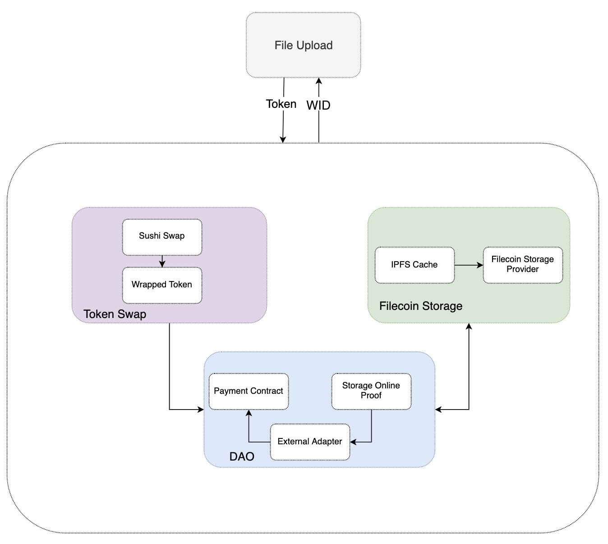

# 开发人员快速入门

多链存储（以下称为“Multichain.Storage”）是一套以太坊扩展解决方案，可实现高吞吐量、低成本的智能合约，同时保持可信赖的安全性。

以下文档描述了如何使用 Multichain.Storage，它目前在 Polygon Mumbai 测试网上运行。 无论您是只想开始构建的开发人员，还是想深入了解 MCS 的内部结构及其工作原理，此站点都是适合您的地方。

### 系统设计 <a href="#xi-tong-she-ji" id="xi-tong-she-ji"></a>



### MCS 是如何运行的？ <a href="#mcs-shi-ru-he-yun-hang-de" id="mcs-shi-ru-he-yun-hang-de"></a>

如果您想了解 MCS 的运行原理，最好从 用户指南部分开始，它提供了 MCS 内部结构的概述。 从那里，您可以跳转到有关系统各个组件的更详细的解释。

### 模块 <a href="#mo-kuai" id="mo-kuai"></a>

**代币交换：** 代币交换模块负责将用户的代币换成包裹的代币，可以是USDC或其他代币。

1、用户在上传文件时支付 USDC 或其他代币，这些代币称为用户代币。

2、Multichain.Storage 在将数据存储到 Filecoin 网络时使用 FIL（称为包装代币）进行支付。

3、用户代币应通过此模块更改为包装代币，此步骤称为代币交换。

4、代币交换是通过 DEX 的 Sushi Swap 完成的。

**支付模块：**

1、上传文件后，根据 ：

* 矿工平均价格
* 文件大小
* 持续时间

然后估计的金额将被锁定到付款合同地址，请参阅[配置](https://github.com/filswan/multi-chain-payment#Configuration)。

2、在解锁步骤中，通过Swan平台FIL钱包向Filecoin网络支付的金额，将转入MCS支付接收地址，详见[配置](https://github.com/filswan/multi-chain-payment#Configuration)。

3、在退款步骤中，锁定的超额支付部分将返回到用户钱包。

\*\*Swan Client API：\*\*可以找到更多信息 [这里](https://github.com/filswan/go-swan-client)。

\*\*DAO 签名：\*\*如果 DAO 检测到上传的文件已被链接，则会触发签名操作。

\*\*Data DAO：\*\*更多信息可以在 [Flink](https://github.com/filswan/flink)。

\*\*IPFS：\*\*可以找到更多信息 [这里](https://docs.ipfs.io/)。

\*\*Filecoin存储：\*\*可以找到更多信息 [这里](https://lotus.filecoin.io/docs/set-up/install/)。

### 如何开始构建 <a href="#ru-he-kai-shi-gou-jian" id="ru-he-kai-shi-gou-jian"></a>

#### 先决条件 <a href="#xian-jue-tiao-jian" id="xian-jue-tiao-jian"></a>

* 操作系统： Ubuntu 20.04 LTS
* Mysql5.5+
* Lotus 节点
* IPFS Client

**Lotus 节点**

* Lotus 节点用于制作Car文件和发送离线交易。
* 在与 MCS 相同的机器上安装 Lotus 节点或 Lotus lite 节点。
* Lotus全节点相对于Lotus轻节点来说太重了，所以首选Lotus轻节点。
* Lotus lite 节点依赖于一个 Lotus 节点，所以在使用 Lotus lite 节点时要确保某个地方有一个 Lotus 节点。

**Option1️⃣** [安装Lotus全节点](https://lotus.filecoin.io/docs/set-up/install/)

\*\*选项2️⃣ \*\*[安装Lotus轻节点](https://lotus.filecoin.io/docs/set-up/lotus-lite/#amd-and-intel-based-computers)

#### 安装 <a href="#an-zhuang" id="an-zhuang"></a>

\*\*选项1️⃣ 预构建包：\*\*请参阅[**release assets**](https://github.com/filswan/multi-chain-payment/releases)资产

```shell
wget https://github.com/filswan/multi-chain-payment/releases/tag/v1.0.1/install.sh
./install.sh
```

**选项2️⃣ 源代码**

🔔**go 1.16+** 为必填项

```shell
git clone https://github.com/filswan/multi-chain-payment.git
cd multi-chain-payment
git checkout <release_branch>
./build_from_source.sh
```

#### 安装后 <a href="#an-zhuang-hou" id="an-zhuang-hou"></a>

* 在执行之前，您应该在 `~/.swan/mcp/config.toml` 中检查您的配置，以确保它是正确的。

```shell
vi ~/.swan/mcp/config.toml
```

* 在执行之前，您应该在 `~/.swan/mcp/.env` 中检查您的环境变量，以确保它是正确的。

```shell
vi ~/.swan/mcp/.env
```

* 在相关文件中设置配置和 env 变量后，您可以在 `./build` 目录中运行`多链支付`。

```shell
./build/multi-chain-payment
```

**注意**

* 日志位于目录 `./logs 中`
* 您可以在`./multi-chain-payment`之前添加 `nohup`，以忽略 HUP（挂断）信号，从而避免在注销时停止。
* 你可以加 `>> mcp.log`在命令中让所有日志输出到 `mcp.log`.
* 你可以加 `&`在命令末尾让程序在后台运行。
* 如：

```shell
nohup ./multi-chain-payment-0.2.1-rc1-unix >> mcp.log &   #After installation from Option 1
nohup ./build/multi-chain-payment >> ./build/mcp.log &    #After installation from Option 2
```

### 配置 <a href="#pei-zhi" id="pei-zhi"></a>

您需要修改配置文件并输入您的配置参数，下面将介绍配置项：

\*\*config.toml \*\*

* **port**：Web API 端口。
* **release** ：在发布模式下工作时：将此设置为 true，否则设置为 false 和环境。 变量 GIN\_MODE 不释放。
* **swan\_platform\_fil\_wallet** ：用于在 Filecoin 网络上支付的钱包地址。
* **filink\_url** ：可以从这里搜索交易数据。

\*\*Lotus \*\*

* **client\_api\_url** ：lotus 客户端 web api 的 URL，如： `http://[ip]:[port]/rpc/v0`，一般来说 `[port]`是 `1234`. 请参阅 [Lotus API](https://docs.filecoin.io/reference/lotus-api/#features)
* **client\_access\_token** ：lotus 客户端 web api 的访问令牌。 它应该具有管理员访问权限。 您可以使用命令从您的 Lotus 节点机器获取它 `lotus auth create-token --perm admin`. 请参阅 [Obtaining Tokens](https://docs.filecoin.io/build/lotus/api-tokens/#obtaining-tokens)

**ipfs\_server**

* **download\_url\_prefix** ：IPFS 服务器 url 前缀，如： `http://[ip]:[port]`. 存储Car文件以供存储提供商下载。 Car文件网址将是 `[download_url_prefix]/ipfs/[file_hash]`
* **upload\_url\_prefix** ：上传文件的IPFS服务器url，如 `http://[ip]:[port]`

**swan\_task**

* **dir\_deal** ：用于保存生成的 Car 文件和 CSV 的输出目录。
* **verify\_deal** : \[true/false] 此任务中的交易是否为真实数据。
* **fast\_retrieval** : \[true/false] 表示数据应该可用于快速检索。
* **start\_epoch\_hours** : start\_epoch 从当前时间开始以小时为单位的交易。
* **expired\_days** ：存储提供商密封数据的预期完成天数。
* **max\_price** ：愿意为每个 GiB/epoch 支付离线交易的最高价格。
* **generate\_md5** : \[true/false] 是否为每个Car文件生成MD5，注意：这是一个消耗资源的动作。

**Polygon**

* **rpc\_url** ：您的Polygon网络 RPC URL。
* **payment\_contract\_address** ：Polygon上的Swan支付网关地址以锁定资金。
* **sushi\_dex\_address** : Polygon上的寿司地址。
* **usdc\_wFil\_pool\_contract** ：从Polygon上的寿司获取 USDC 和 wFil 之间汇率的地址。
* **dao\_contract\_address** ：Polygon上的Swan DAO 地址，用于接收 DAO 签名。
* **mcp\_payment\_receiver\_address** ：MCS 钱包地址，用于从解锁操作中接收资金。
* **gas\_limit** ：交易的Gas限制。
* **unlock\_interval\_minute** : 2 次解锁操作之间的解锁间隔（分钟），不能小于 1。

\*\*.env \*\*

* **privateKeyOnPolygon** ：钱包的私钥，用于在Polygon网络上执行合约方法并支付 gas。


### &#x20;<a href="#setup-local-geth-and-rollup-blockchain" id="setup-local-geth-and-rollup-blockchain"></a>

### &#x20;<a href="#hello-arbitrum" id="hello-arbitrum"></a>
