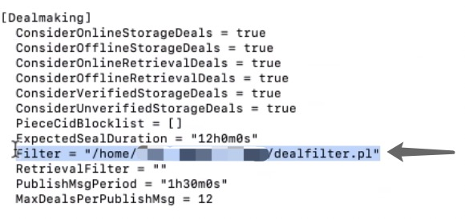

# Swan Provider安装教程中文版

## 介绍

Swan Provider 提供以下功能:

• 使用aria2 自动下载离线交易

• 下载完成后，使用lotus 节点导入交易

• 将交易状态同步到Swan 平台，使客户以及存储提供商实时了解状态进展

• 自动得到来自FilSwan 平台上的竞拍任务

• 存储提供商目前接单可以得到十倍增益

## 安装以及配置步骤

### 1. 前提条件


请确保你具备前提条件再执行后期安装过程


#### 1.1 aira2 安装

aira2 是一个下载工具，它的安装是用于把用户发的单下载到Swan Provider 运行的电脑/服务器

```
sudo apt install aria2
```

#### 1.2 Lotus Miner 创建

```
lotus-miner auth create-token --perm write
```

### 2. 安装


可以在以下2 种方式中选择任意一种，我们更加推荐选择一


#### 2.1 选择一 Prebuilt Package

```
mkdir swan-provider
cd swan-provider
wget https://github.com/filswan/go-swan-provider/releases/download/v0.2.1-rc1/install.sh
chmod +x ./install.sh
./install.sh
```

#### 2.2 选择二Source Code (需要满足go 1.16+)

```
git clone https://github.com/filswan/go-swan-provider.git
cd go-swan-provider
git checkout <release_branch>
./build_from_source.sh
```

###

### 3.配置文件


Swan Provider 可能会因为你没有配置文件而退出，在这种情况下你需要：


**3.1** 修改配置文件

```
vim ~/.swan/provider/config.toml
```

#### 3.2 - option 1⃣️如果你在安装中选择了第一个选项Prebuilt Package&#x20;

输入以下命令行执行Swan- Provider

```
./swan-provider-0.2.0-unix    #After installation from Option 1
```

#### 3.2- option 2⃣️ 如果你在安装中选择了第二个选项Source Code

输入以下命令行执行Swan- Provider

```
./build/swan-provider        #After installation from Option 2
```


### 4.说明

4.1. Log 日志文件在 ./logs 里面

4.2. 你可以在 ./swan-provider 前添加 nohup ，可以防止在登出logout 后出现挂起信号停止服务

4.3. 你可以在 ./swan-provider 前面或者后面添加 &，使程序在后台持续运行

#### Option 1⃣️如果你在安装中选择了第一个选项Prebuilt Package&#x20;

```
nohup ./swan-provider-0.2.0-unix >> swan-provider.log &   #After installation from Option 1
```

#### Option 2⃣️如果你在安装中选择了第二个选项Source Code

```
nohup ./build/swan-provider >> swan-provider.log &        #After installation from Option 2
```

###

### 5. 配置解释

#### **5.1. \[port] ] 端口**

默认值为 8888，如需要请自行更换端口值

#### 5.2 \[lotus]

* ****:information\_source:**client\_api\_url:** Lotus client web 的API 网址，表现形式如`http://[ip]:[port]/rpc/v0`, 一般端口号 `[port]` 为 `1234`. 详情查看 [Lotus API](https://docs.filecoin.io/reference/lotus-api/)
* ****:information\_source:**market\_api\_url:** Lotus market 的API 网址, 表现形式如: `http://[ip]:[port]/rpc/v0`, 一般端口号 `[port]` 为  `2345`.当 market and miner在不分开的情况下,也是miner web 的API 网址。详情查看 [Lotus API](https://docs.filecoin.io/reference/lotus-api/)
* ****:information\_source:**market\_access\_token:** Lotus market web API 下的Access token. 当 market and miner在不分开的情况下,也是miner 的access token.&#x20;

#### 5.3 \[aria2]

* aria2\_download\_dir: 离线单下载且等待导入的文件地址，一般无需更改
* aria2\_host: aria2 服务器地址，一般无需更改
* aria2\_port: Aria2 服务器端口，一般无需更改
* aria2\_secret: 必须与 rpc-secure 在aria2.conf 的值统一，一般无需更改

#### 5.4 \[main]

* api\_url: Swan 的API 地址 "https://api.filswan.com" 一般无需更改
* :information\_source:miner\_fid: 你的存储服务商ID 号
* import\_interval: 每个交易中间的导入时间间隔，600 秒/10 分钟，一般无需更改
* scan\_interval: 在 Swan 平台上扫描所有正在进行的交易和更新状态的时间间隔，600 秒/10 分钟，一般无需更改
* :information\_source:api\_key: 你的 api key. 可以从Swan 平台得到，打开[网址](https://www.filswan.com)，点击 "个人信息"->"开发人员设置". 如图所示

.tiff>)

* :information\_source:access\_token: 你的access token. 可以从Swan 平台得到，打开[网址](https://www.filswan.com)-> "个人信息"->"开发人员设置".
* api\_heartbeat\_interval: 心跳检测的时间间隔，300 秒或者5 分钟，一般无需更改

#### 5.5 \[bid]用于设置自动竞拍

* bid\_mode: 0-选择竞拍模式，设置为手动 ；1- 选择竞拍模式，设置为自动
* expected\_sealing\_time: 设置期待封装时间，1920 epoch 或者16 小时，1epoch=30 秒。交易设置开始过早会有拒绝的风险。一般无需更改。
* start\_epoch: 设置epoch 开始的时间，2880 epoch 或者24 hours.
* auto\_bid\_task\_per\_day: 设置每天自动接受任务的上限数量。

## Swan Provider支持

### 1. 如果您在接单过程中总出现拒绝信息

#### 1.1 查看是否过滤器设置有误

如果用户设置过滤器有误，则会导致订单被过滤出去，在接单过程中出现拒绝消息。过滤器的设置包括设置白名单以及设置黑名单。 白名单是设置能接受订单的地址，白名单以外的地址都不可以接受订单。黑名单是设置不能接受订单的地址地址，黑名单以外的用户都可以接受订单。所以一般情况下白名单比黑名单限制的用户要更多一些。因此，如果地址设置了白名单，用户可以接受白名单上的地址的订单，其他的订单都会被过滤出去。&#x20;

首先，可以通过以下命令行查看订单是否被拒绝

```
lotus-miner stroage-deals list -v| grep deal_cid
```

如果订单被拒绝，可以通过如下图所示，在存储提供商Miner的config文件里，\[**Dealmaking**]下则可以查看接单的filter是否设置错误



下图是设置黑名单的过滤器的展示: 红色圈出来的地址为黑名单地址，不接受此地址的订单


下图是设置白名单的过滤器的展示: 红色圈出来的地址为白名单地址，只接受此地址的订单


